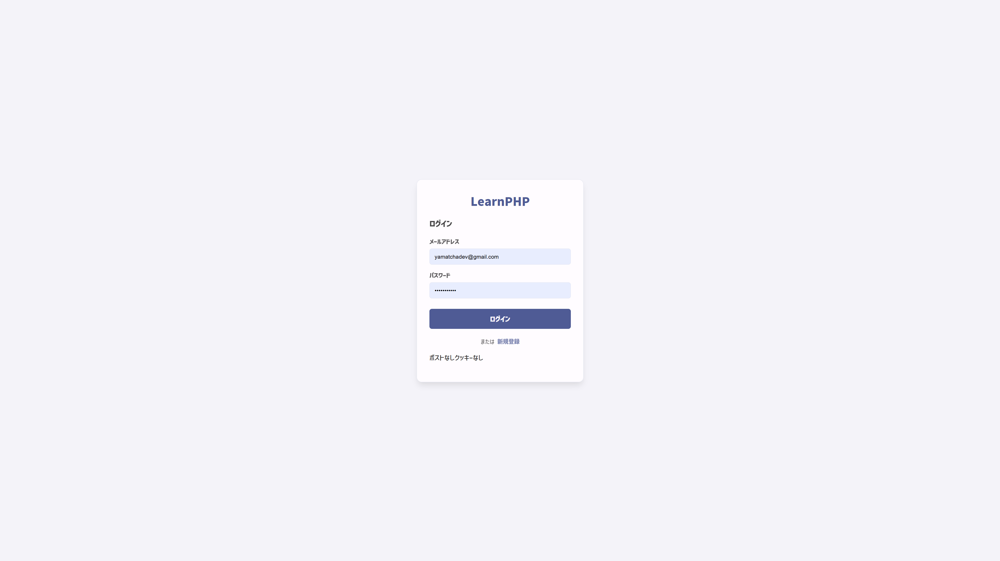
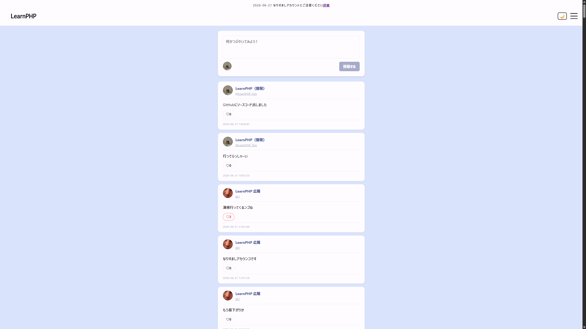
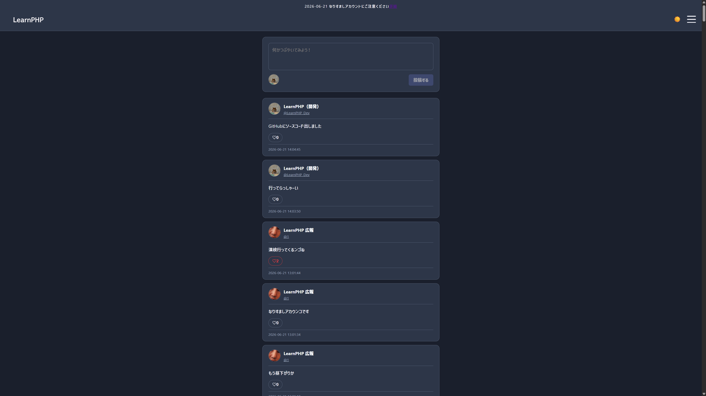
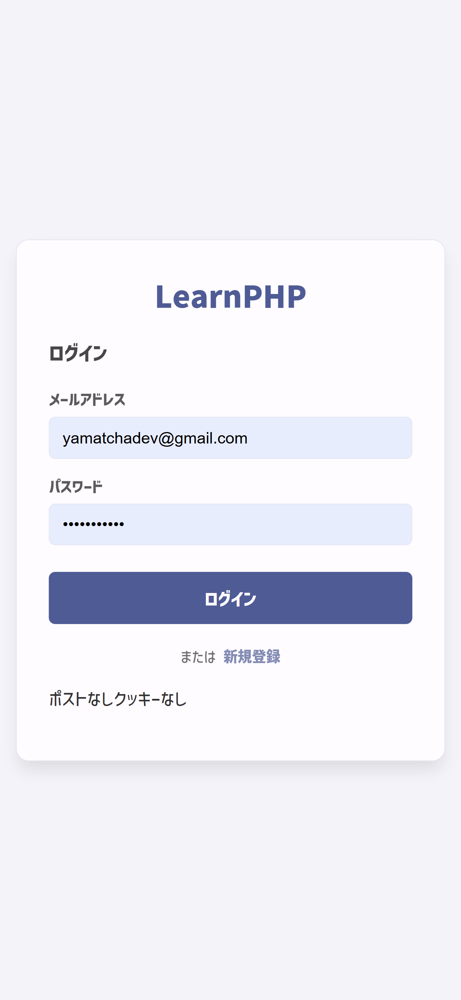
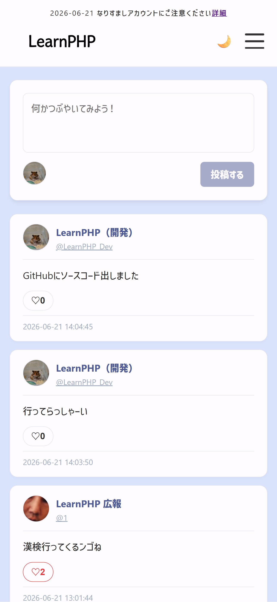
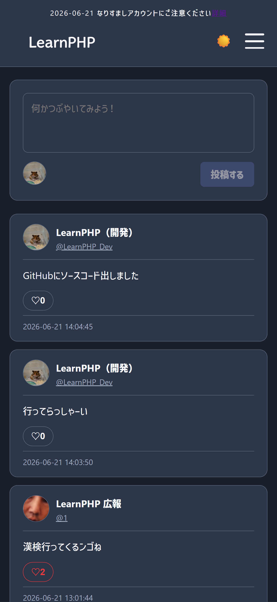

# LearnPHP Social App

PHP・MySQL・バニラJavaScriptで構築した、学習目的のソーシャルタイムラインWebアプリです。

---

## 📸 スクリーンショット
- **PC画面**

- **モバイル画面**

---

## 機能一覧

- **ユーザー認証** — 登録・ログイン・ログアウト・Remember Me（Cookie）
- **タイムライン** — 投稿の作成・削除・リアルタイム風自動更新（ポーリング）
- **いいね機能** — 投稿へのいいね（重複防止付き）
- **返信機能** — 投稿へのスレッド返信（`parent_id`による管理）
- **プロフィールページ** — ユーザーごとの投稿一覧・アイコン表示
- **アイコンアップロード** — プロフィール画像のアップロード・バリデーション
- **メール送信** — Gmail API（OAuth2）によるメール送信
- **XSS対策** — `htmlspecialchars()` による出力エスケープ

---

## 使用技術・環境

| カテゴリ | 技術 |
|---|---|
| バックエンド | PHP（PDO） |
| データベース | MySQL / MariaDB |
| フロントエンド | HTML / CSS / Vanilla JavaScript |
| ローカル環境 | XAMPP（Apache） |
| 外部API | Gmail API（Google OAuth2） |
| インフラ | Cloudflare Tunnel |
| バージョン管理 | Git / GitHub |

---

## データベース構成（主要テーブル）

- `users` — ユーザー情報・アイコンパス
- `posts` — 投稿（`parent_id` で返信を管理）
- `likes` — いいね（`UNIQUE KEY(user_id, post_id)`）

---

## AI生成について

すべてのCSSはGemini,JavaScript、明記されている箇所のHTMLはClaudeで生成しました。
また、ヘッダーのニュース部分はMJCraftで使用しているコードを一部転用しています。
あくまでもこのプロジェクトは、私自身がPHPを学習するために制作しています。
このコードの安全性は保障できません。ご了承ください。

## ライセンス

This project is for learning purposes only.
